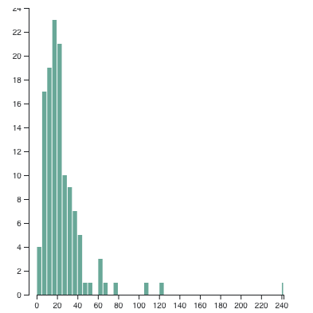
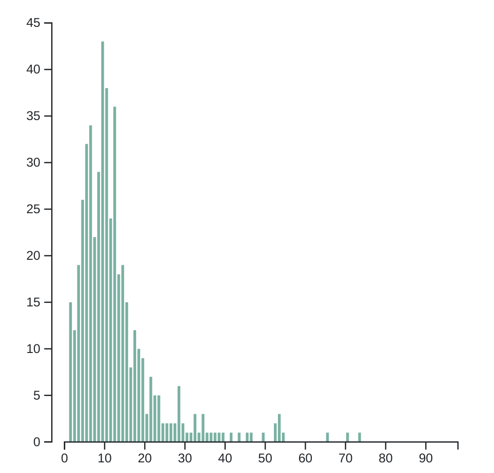
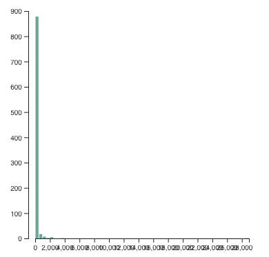
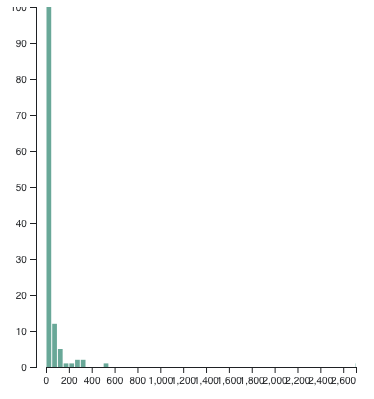
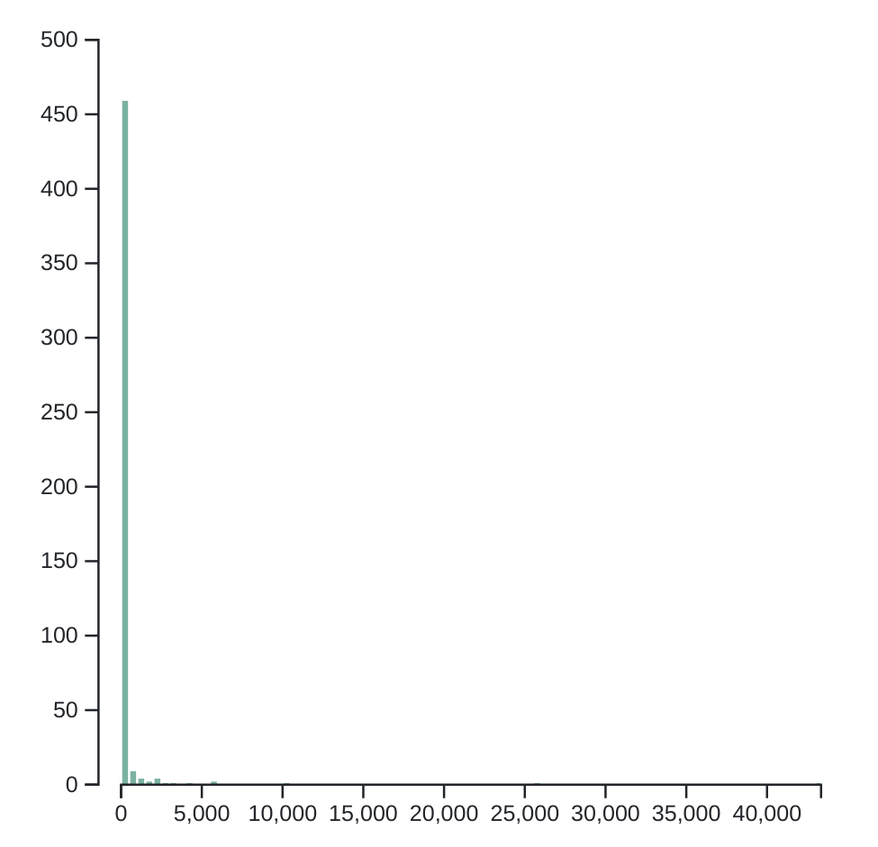

# Project of Data Visualization (COM-480)

| Student's name | SCIPER |
| -------------- | ------ |
| Tobias Oberdoerfer | 367487 |
| Hugo Lanfranchi | 300585 |
| Jonas Blanc | 287508 |

## Milestone 1 (23rd April, 5 pm)

**10% of the final grade**

This is a preliminary milestone to let you set up goals for your final project and assess the feasibility of your ideas.
Please, fill in the following sections about your project.

*(max. 2000 characters per section)*

### Dataset

For this project, we will use WhatsApp chats, including messages and metadata, as well as the contacts and the architecture of groups, as our dataset.
Using WhatsApp data as a resource puts us in a unique position: we can customize the dataset and visualization for each user on our website.
Indeed, with two billion monthly active users, WhatsApp is one of the leading social networks for messaging.

To this end, we have built a web system that acts as a client (like What's App web) for the WhatsApp API.
The user simply scans the QR code displayed.
As soon as the user is logged in, our web application retrieves locally (in the user's browser) the user's WhatsApp data for the last three years. As long as the user is logged in, new messages flow in and are integrated into our dynamic visualizations.

Several layers in several languages are needed to achieve such results.
We will focus on the format of the data received by the javascript layer, after pre-processing and formatting in the lower layers, as this is the format that will be used as a basis for the visualizations.

We have three types of application messages that transmit new data. The first is the message, here is its architecture:
```
<message_id> : 
{
  chat: <chat_id>,
  id: <message_id>
  message: <message_text>
  sent-by: <contact_id>
  timestamp: <date_time>
}
```
Here the `chat_id` can either be a `contact_id` for private chats, or a `group_id` if the message was sent to a group chat. 
The second one is a contact message:
```
<contact_id> : 
{
  id: <contact_id>
  status: <conatct_status>
  name: <contact_name>
  avatar: <link_to_avatar_picture>
}
```
The third and final type of application message received by the javascript layer is describing a chat:
```
<group_id> : 
{
  avatar: <link_to_avatar_picture>
  name: <chat_name>
  owner_id: <chat_owner_id>
  participants: [<particpant_id>, ..]
  topic: <chat_topic>
}
```
Both the `chat_owner_id` and the `particpant_id`s are again `contact_id`s to link them back to actual people.

Our dataset is therefore a collection of tens of thousands (depending on the user's network/activity) of such messages, and hundreds of groups and contacts.

### Problematic

We deeply believe that WhatsApp data is a goldmine (no wonder Meta is funding it even though WhatsApp doesn't benefit directly).
Equipped with our data science and data visualization tools, we aim to extract and present the valuable knowledge hidden in this massive amount of data.
Our website will present actionable insights like a jeweler would present gold rings, without the customer having to get their hands dirty. 

WhatsApp is used to communicate with family and friends, but also with the professional network.
Indeed, communication on WhatsApp is so easy that many people are abandoning email.
Today, many organizations and freelancers (including, unofficially, the Swiss army) rely on WhatsApp to carry out their daily activities.

The main goal of our visualizations is to give the user an overview of his (contact) network.
A good understanding of the landscape of your connections allows you to maintain and exploit them. We plan to build a visualization that answers the following questions.
Who is in your network and how close are you to them? Who is connected to whom?
In what context do you know someone? 

Once the user has a good level of understanding of their network, we want to allow them to dig deeper into a specific contact/group.
What are the main topics discussed?
What time of day (or night) is the person most responsive?
What is the typical language used to communicate with this person? 

Easy access to these answers will undoubtedly facilitate the management of a professional (or even friendly) network.

### Exploratory Data Analysis
Based on the app messages explained in the dataset section above, we create data structures that let us compute some interesting statistics. We report here some of these exploratory statistics for three different users with different WhatsApp usage (this is based on real-world WhatsApp data).

| Statistics                                       | User 1       | User 2    | User 3     |
|--------------------------------------------------|--------------|-----------|------------|
| Number of messages                               | 98'729       | 7405      | 141'134    |
| Number of contacts                               | 1010         | 191       | 758        |
| Number of groups                                 | 179          | 22        | 87         |
| Number of chat                                   | 422          | 155       | 147        |
| Number of unique words                           | 68'658       | 19'028    | 130'272    |
| Most frequent word                               | "de": 26'149 occurrences| "de": 4489 occurrences | "I": 35'319 occurrences |
| Average message length                           | 10.09 words| 20.15 words| 11.77 words|
| Histogram: Average length of message per contact || ||
| Histogram: Average number of message per contact ||||

Note that this is just a quick data analysis/exploration of the data to demonstrate its potential, with many aspects that can be improved as we continue to work on the project.
Firstly as we can see that the most frequent word is not very interesting due to the low-level parsing we applied.
The main visualizations we are planning do not rely on individual words, so we did not spend too much time building the tokenizer (excluding stop words, etc).
Secondly, concerning the histograms, they are designed as a preview of the data and not as actual visualization.
They could be greatly improved in many ways (log scale, labels on axis, title, etc).
However, they already give some insights such as the vast majority of people send less than 200 messages and only a few send a huge amount of messages. 
We think it would be useful to exclude the user from the second graph, as he is probably the person who sends the most messages.

User 2 has very limited usage of WhatsApp and yet this exploratory analysis which only scratches the tip of the iceberg, already shows us that there is potential for meaningful visualizations.

### Related work

Because for our approach the data will be new/different for each user, we can not compare our dataset directly to existing ones.
Nevertheless, Whatsapp chat analyzers already exist, some of them are [WhatsAnalyze](https://whatsanalyze.com/), [ChatAnalyzer](https://chatanalyzer.moritzwolf.com/), [DoubleText](https://doubletext.me/whatsapp/), and [Chatilyzer](https://chatilyzer.com/).
Our approach is different from all of these as we process the messages on the fly, building the visualization progressively as we receive them from WhatsApp servers and parse the messages.
This enables the user to see in real-time the statistics change when using WhatsApp and also does away with the necessary step of backing up the chats.
This is because existing WhatsApp chat analyzers need an uploaded backup of all chats, whereas in our approach the user just scans the QR code like they would for WhatsApp Web.
Existing solutions focus on one chat since WhatsApp makes it difficult to export all chats at once.
Our solution on the other hand captures the whole picture and offers an overview of all chats and contacts.

We took inspiration from graphs that would simulate the dynamics in populations and how the information would spread out in these.
Some pictorial examples are [this](https://cambridge-intelligence.com/wp-content/uploads/2020/07/6.0-PR-feature.png) and [this](https://cvo22.files.wordpress.com/2014/03/inmap.gif).
As it is the conventional manner to visualize communications between human beings, we wanted to keep such a graph as the basis for our visualizations.
Other inspirations we take from already existing chat analyzers.
