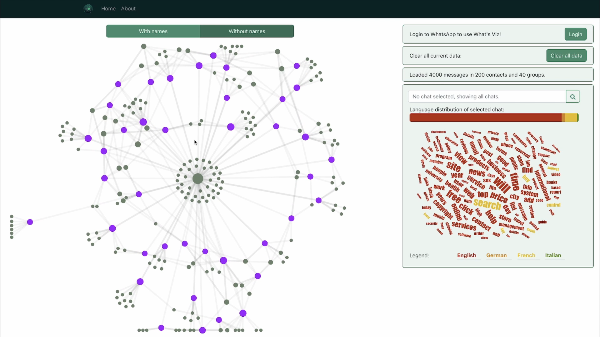

# What's Viz

A project for the Data Visualization (COM-480) course at EPFL.

Try out our website hosted on github.io under [com-480-data-visualization.github.io/project-2023-what-s-viz/](https://com-480-data-visualization.github.io/project-2023-what-s-viz/). 

For the source code of the final project look at the more in-depth technical description in the [README](wa-visualization/README.md) there.

Click below to watch our presentation video of What's Viz:  

If you are interested in reading the process book, you can find it [here](Milestones/Milestone3.pdf).

## Milestones

All of this project was based on the following three milestones:

### Milestone 1 (7th April, 5pm)

**10% of the final grade**

For milestone 1 look [here](Milestones/Milestone1.md).

### Milestone 2 (5th May, 5pm)

**10% of the final grade**

For milestone 2 look [here](Milestones/Milestone2.md) for the handout and [here](Milestones/Milestone2.pdf) for the report.

### Milestone 3 (4th June, 5pm)

**80% of the final grade**

For milestone 3 look [here](Milestones/Milestone3.md).

## Original team members

| Student's name | SCIPER |
| -------------- | ------ |
| Tobias Oberdoerfer | 367487 |
| Jonas Blanc | 287508 |
| Hugo Lanfranchi | 300585 |
